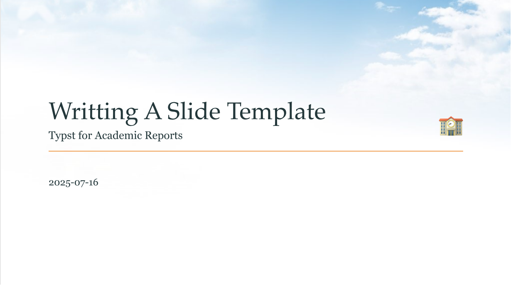

# touying-qslide

A quick-start slide template based on touying for academic reports.

## Get Started

Import `qslide` from the `@preview` namespace.

```typst
#import "@preview/qslide:0.1.0": *
#show: qslide.with(
  title: [],
  subtilte: none,
  author: [],
  // following arguments are optional
  // author-size: 14pt,
  // institute: [],
  // background-img: "img/sky.png",
  // footer: [],
  // footer-size: 14pt,
  // list-indent: 1.2em,
  // lang: "en",
)
```



## Clone Official Repository

Clone the [qslide](https://github.com/ivaquero/touying-qslide) repository to your `@local` workspace:

- Linux：
  - `$XDG_DATA_HOME/typst/packages/local`
  - `~/.local/share/typst/packages/local`
- macOS：`~/Library/Application\ Support/typst/packages/local`
- Windows：`%APPDATA%/typst/packages/local`

Import `qslide` in the document

```typst
#import "@local/qslide:0.1.0": *
```

> For developement convinience, local repo never changes the version
