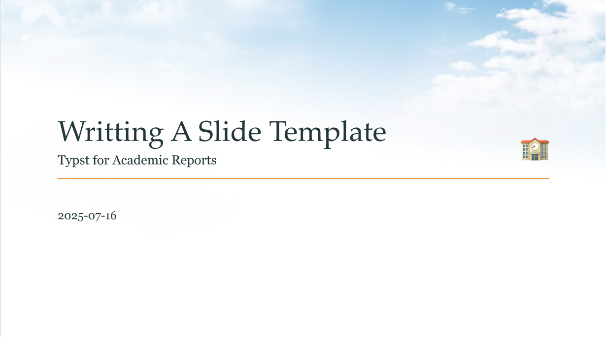

# Touying Quick

Touying Quick is a Typst slide template built on
[Touying](https://github.com/touying-typ/touying). It provides a fast academic report setup with a title slide, outline slide, Metropolis-based theme, background images, localized labels, equation references, theorem environments, styled code blocks, and optional supplementary slides.

## Features

- One-call setup through `touying-quick.with(...)`.
- Automatic title slide, outline slide, and ending slide.
- Metropolis theme with configurable colors, footer, logo, and background image.
- English and Chinese labels by default, with custom language support through TOML.
- Heading-based slide structure powered by Touying.
- Chapter-like equation numbering and references.
- Table and code helpers for academic slides.
- Optional supplementary content after the ending slide.

## Installation

### From Typst Universe

```typst
#import "@preview/touying-quick:0.4.2": *
```

### From a Local Checkout

Clone this repository into Typst's local package directory:

- Linux:
  - `$XDG_DATA_HOME/typst/packages/local`
  - `~/.local/share/typst/packages/local`
- macOS: `~/Library/Application Support/typst/packages/local`
- Windows: `%APPDATA%/typst/packages/local`

Then import the local package:

```typst
#import "@local/touying-quick:0.1.0": *
```

The local package keeps the version at `0.1.0` for development convenience.

## Quick Start

```typst
#import "@preview/touying-quick:0.4.2": *

#let info = toml("config/info.toml").example

#show: touying-quick.with(
  title: "Writing a Slide Template",
  subtitle: "Typst for Academic Reports",
  info: info,
)

= Introduction

== Why Typst?

- Plain text source
- Fast compilation
- Strong math and layout primitives
```



## Slide Structure

Touying Quick uses Touying's heading-based slide structure. With the default
configuration, top-level headings create sections, and lower-level headings create
slides.

```typst
= Section Title

== Slide Title

Slide content.

---

This creates another slide without changing the current heading.
```

The template calls `title-slide()` and creates an outline automatically before
your content. It also adds an ending slide after your content.

## Configuration

Most configuration is passed to `touying-quick.with(...)`.

```typst
#show: touying-quick.with(
  title: "Report Title",
  subtitle: "Report Subtitle",
  // heading-idx: true,
  // bgimg: bgsky,
  // theme: "blue",
  // info: default-info,
  // styles: default-styles,
  // names: default-names,
  // logo: emoji.bookmark,
  // supplement: [],
  // lang: "en",
  // doc,
)
```

### Document Info

`info` controls metadata used by the title slide, footer, language, and ending slide.

```typst
#let info = toml("config/info.toml").example
```

```toml
[example]
    footer = "Clayton University"
    header = ""
    lang = "en"
    author = "ivaquero"
    series = "Typst Slides Tutorial"
    institution = "School of Artificial Intelligence"
    ending = "Thanks for Your Attention"
```


### Styles

If you are not satisfied with the default styles such as font-family, font-size, you can create a toml like

```toml
[fonts.en]
title = "Palatino"
subtitle = "Palatino"
author = "Times New Roman"
footer = "Georgia"
contents = "Georgia"
context = "Georgia"
math = "Times New Roman"
ending = "Palatino"

[sizes]
author = 14
title = 40
context = 10.5
footer = 10
ending = 50

[spaces]
par-indent = 2
par-leading = 1
par-spacing = 1
list-indent = 1.2
block-above = 1
block-below = 1
contents-indent = 2
```

after reading this file by `toml()`, assign its value to the `styles` argument in function `touying-quick()`.

### Names

touying-quick's section names support English and Chinese by default. If you are not neither English speaker nor Chinese speaker, assume you are a French speaker, you can create a toml, for example `names.toml`, like

```toml
[sections.fr]
    outline = "Sommaire"

[blocks.fr]
    algorithm = "Algorithme"
    table = "Tableau"
    figure = "Figure"
    equation = " Eq. "
    rule = "Règle"
    law = "Loi"
```

```typst
#let info = toml("config/info.toml").example
#let names = toml("config/names.toml")

#show: touying-quick.with(
  title: "Rapport",
  info: info,
  names: names,
)
```

Make sure `info.lang` exists in both `names` and `styles`.

### Supplementary Slides

When `supplement` is not empty, it is displayed after the ending slide. This is useful for backup slides, appendices, or extra contents. A handy usage is include your supplements in it, for example

```typst
#show: touying-quick.with(
  ...,
  supplement: [
    #include("supplementary-content-1.typ")
    #include("supplementary-content-2.typ")
  ],
)
```

## API Reference

### Main Template

`touying-quick(title: "", subtitle: "", heading-idx: true, bgimg: bgsky, theme: "blue", info: default-info, styles: default-styles, names: default-names, logo: emoji.bookmark, supplement: [], lang: "en")[doc]`

- `title`: title shown on the title slide.
- `subtitle`: subtitle shown on the title slide. Empty values fall back to
  `info.series`.
- `heading-idx`: enables heading numbering when `true`.
- `bgimg`: background image path.
- `theme`: key under `styles.colors`.
- `info`: metadata table.
- `styles`: style table.
- `names`: localized names table.
- `logo`: logo passed to Touying's `config-info`.
- `supplement`: content displayed after the ending slide.

### Utilities

- `tableq(data, k, inset: 0.3em, stroke-color: rgb("000"))`: render CSV data as
  a centered three-line table.
- `table-three-line(stroke-color)`: stroke helper for three-line tables.
- `table-no-left-right(stroke-color)`: stroke helper for tables without left and
  right borders.
- `code(text, lang: "python", breakable: true, width: 100%)`: render a styled
  raw code block.
- `tip`, `note`, `quote`, `warning`, `caution`: theorem-style blocks from
  Theorion.

## Examples

- [`examples/example.typ`](examples/example.typ): a compact deck that exercises
  the main template settings and common slide content.

## Credits

Thanks @OrangeX4 for his [touying](https://github.com/touying-typ) framework as well as his [theorion](https://github.com/OrangeX4/typst-theorion) package.

Also thanks the creators of the following packages

- @Dherse: [codly](https://github.com/Dherse/codly)
